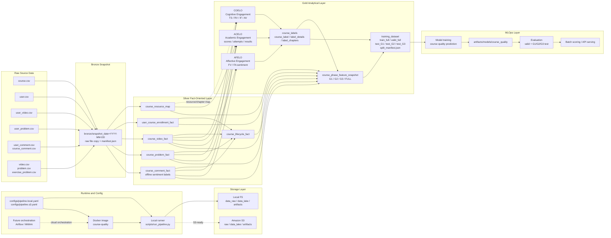
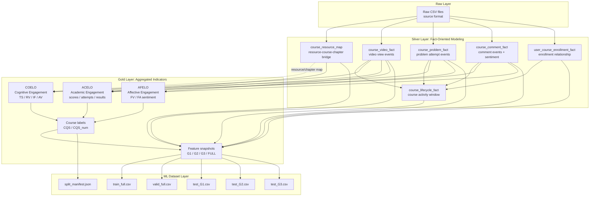
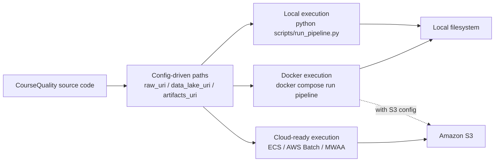

# Early-Prediction-Course-Quality
- Designed a course quality prediction framework from the MoocubeX dataset by processing 13 relational learning analytics
tables with up to 11M+ records. The original dataset available at [https://github.com/THU-KEG/MOOCCubeX](here)
- Built a feature engineering pipeline to compute COELO, AFELO, and ACELO scores at the chapter level, combining multiple
sub-indicators from learner behavior, course engagement, affective feedback based on chapter-level activity. Integrated BERT-
based sentiment analysis on learner comments to generate affective learning signals for the AFELO component.
- Generated final Course Quality Score (CQS) labels by aggregating COELO, AFELO, and ACELO scores and applying
quantile-based discretization into Needs Improvement, Acceptable, and Excellent categories.
- Identified and analyzed predictive features. Compared imbalance learning strategies, including Tomek Links under-sampling,
SMOTE oversampling, CTGAN-based synthetic sampling, and hybrid resampling methods.
- Trained and evaluated multiple machine learning models, with Random Forest + SMOTE-Tomek achieving the best overall
result of 0.818 Macro-F1 and 0.90 recall for the Needs Improvement class.
- Details available at [this google drive link](https://drive.google.com/drive/u/0/folders/1r_ZOKB9jn8U8KBTChkmsPHwwmYisIw7V)

# CourseQuality Data Pipeline Architecture

This diagram describes the current local-first, S3-ready CourseQuality pipeline.
It follows a medallion-style data lake layout: Raw/Bronze, Silver, Gold, then
ML-ready datasets and model artifacts.

## End-to-End Pipeline



## Data Modeling and Lineage



## Engagement Indicator Definitions

```text
COELO - Cognitive Engagement / Mức độ tham gia nhận thức:
Phản ánh nỗ lực tinh thần và mức độ xử lý thông tin sâu của người học.
Chỉ số này được tổng hợp từ 4 thành phần con: TS, RV, IF, và AV.
Các biến số chính được tính từ dữ liệu tương tác user-video và user-problem;
course_resource_map đóng vai trò hỗ trợ map resource/chapter.

ACELO - Academic Engagement / Mức độ tham gia học thuật:
Đo lường trách nhiệm và kết quả học tập thực tế. Chỉ số này được tính toán
dựa trên điểm số, số lần thử, và kết quả làm bài tập của người học được ghi
nhận trong hệ thống.

AFELO - Affective Engagement / Mức độ tham gia cảm xúc:
Đánh giá thái độ và sự hứng thú của người học. Chỉ số này được xác định qua
FV và FA. Trong đó, FA được xác định bằng sentiment analysis trên dữ liệu
comment và user-comment của học viên.
```

## Current Execution Modes


